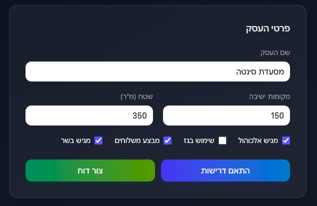

# Business Licensing Assistant (Restaurants – Israel)
## מערכת הערכת רישוי עסקים

## Overview
A comprehensive system that helps food businesses in Israel understand key licensing and compliance requirements. The application processes official regulatory data from PDF documents, collects business information through a digital questionnaire, matches relevant requirements using intelligent algorithms, and generates personalized Hebrew reports powered by AI language models.

## 🎯 Goal
Transform complex regulatory requirements into clear, actionable guidance for restaurant owners by combining structured data processing with AI-powered report generation in Hebrew. The system demonstrates the integration of traditional development practices with modern AI tools to create a practical business solution.

## 🏗️ Architecture

### System Components
- **Frontend**: React + Vite + Tailwind CSS (RTL Hebrew interface)
- **Backend**: Node.js + Express API
- **AI Integration**: Google Gemini (with fallback to plain text)
- **Data Layer**: JSON-based structured requirements
- **Matching Engine**: Rule-based requirement filtering

### Data Flow
```
PDF Document → AI Processing (Gemini) → Structured JSON → Matching Engine → AI Report Generation → Hebrew Report
```

### System Architecture Diagram
```
┌─────────────────┐    ┌──────────────────┐    ┌─────────────────┐
│   PDF Source    │───▶│  AI Processing   │───▶│  JSON Database  │
│ (18-07-2022.pdf)│    │   (Gemini API)   │    │ (requirements)  │
└─────────────────┘    └──────────────────┘    └─────────────────┘
                                                        │
┌─────────────────┐    ┌──────────────────┐    ┌─────────────────┐
│  React Frontend │◀───│  Express API     │◀───│  Matching Logic │
│  (Hebrew RTL)   │    │  (Node.js)       │    │  (Rule-based)   │
└─────────────────┘    └──────────────────┘    └─────────────────┘
                                │
                       ┌──────────────────┐
                       │  AI Report Gen   │
                       │  (Gemini API)    │
                       └──────────────────┘
```

## 🛠️ Tech Stack

### Frontend
- **React 19.1.1** - Modern UI framework
- **Vite 7.1.5** - Fast build tool and dev server
- **Tailwind CSS 4.1.13** - Utility-first styling
- **React Markdown** - Report rendering
- **html2pdf.js** - PDF generation

### Backend
- **Node.js** - Runtime environment
- **Express 5.1.0** - Web framework
- **CORS** - Cross-origin resource sharing
- **dotenv** - Environment configuration

### AI Integration
- **Google Generative AI** - Primary LLM provider
- **Gemini 1.5 Flash** - Language model for Hebrew report generation
- **Fallback System** - Plain text generation if AI fails

## 📁 Project Structure
```
business-licensing-assistant/
├── client/                    # React frontend
│   ├── src/
│   │   ├── App.jsx           # Main application component
│   │   ├── api.js            # API communication
│   │   └── assets/           # Static assets
│   ├── package.json
│   └── vite.config.js
├── server/                    # Express backend
│   ├── src/
│   │   ├── controllers/      # Route handlers
│   │   │   ├── reportController.js
│   │   │   └── requirementsController.js
│   │   ├── routes/           # API routes
│   │   │   ├── report.js
│   │   │   └── requirements.js
│   │   ├── services/         # Business logic
│   │   │   ├── aiService.js  # AI integration
│   │   │   └── matcher.js    # Requirement matching
│   │   ├── data/             # Data layer
│   │   │   ├── raw/          # Original PDF source
│   │   │   │   └── 18-07-2022_4.2A.pdf
│   │   │   └── processed/    # Normalized JSON
│   │   │       └── requirements.json
│   │   └── index.js          # Server entry point
│   ├── scripts/              # Data processing scripts
│   │   └── pdfToJson.js      # PDF to JSON converter
│   └── package.json
├── screenshots/              # System screenshots
│   ├── screenshot-form.png
│   ├── screenshot-matches.png
│   └── screenshot-report.png
├── README.md
└── משימה.md                  # Hebrew task specification
```

## 🚀 Quick Start

### Prerequisites
- Node.js (v16 or higher)
- npm or yarn
- Google Gemini API key (optional, for AI features)

### Installation & Setup

1. **Clone and navigate to project**
   ```bash
   git clone https://github.com/Bar1996/business-licensing-assistant
   cd business-licensing-assistant
   ```

2. **Setup Backend**
   ```bash
   cd server
   npm install
   cp .env.example .env  # Configure environment variables
   npm run dev          # Starts on http://localhost:3000
   ```

3. **Setup Frontend**
   ```bash
   cd ../client
   npm install
   npm run dev          # Starts on http://localhost:5173
   ```

4. **Configure AI (Optional)**
   ```bash
   # In server/.env
   GEMINI_API_KEY=your_gemini_api_key
   GEMINI_MODEL=gemini-1.5-flash
   LLM_PROVIDER=gemini
   ```

5. **Process PDF Data (Optional)**
   ```bash
   cd server
   npm run parse:pdf
   # This runs: node scripts/pdfToJson.js src/data/raw/18-07-2022_4.2A.pdf src/data/processed/requirements.json
   ```

### Running the Application
1. Start both servers (backend on :3000, frontend on :5173)
2. Open http://localhost:5173 in your browser
3. Fill out the business questionnaire
4. Click "התאם דרישות" to see matched requirements
5. Click "צור דוח" to generate AI-powered Hebrew report

## 📄 PDF Data Processing

### Overview
The system includes a sophisticated PDF processing pipeline that converts official regulatory documents into structured JSON data using AI-powered text analysis.

### PDF Processing Script
The `scripts/pdfToJson.js` script processes the official regulatory PDF document and extracts specific sections using Google Gemini AI:

#### Script Features
- **AI-Powered Extraction**: Uses Google Gemini 1.5 Flash to parse and structure Hebrew regulatory text
- **Section Targeting**: Extracts specific regulatory sections (3.3, 3.5, 4.6, 4.7, 4.3)
- **JSON Normalization**: Converts unstructured text into structured requirement objects
- **Error Handling**: Robust error handling with fallback mechanisms
- **Hebrew Language Support**: Native support for Hebrew text processing

#### How to Run
```bash
# From server directory
npm run parse:pdf

# Or directly
node scripts/pdfToJson.js src/data/raw/18-07-2022_4.2A.pdf src/data/processed/requirements.json
```

#### Script Dependencies
- `pdf-parse`: PDF text extraction
- `@google/generative-ai`: AI processing
- `dotenv`: Environment configuration

#### Output Structure
The script generates a `requirements.json` file with the following structure:
```json
[
  {
    "id": "unique_identifier",
    "title": "Requirement Title in Hebrew",
    "appliesWhen": {
      "areaM2": { "gte": 1 },
      "servesAlcohol": true
    },
    "authority": "Regulatory Authority",
    "priority": "high|medium|low",
    "steps": ["Action step 1", "Action step 2"],
    "legalRef": "Legal reference"
  }
]
```

#### Current Data
The current `requirements.json` file contains 5 processed requirements:
1. **CCTV System for Alcohol Venues** (משטרת ישראל)
2. **Alcohol Sales Signage and Minors** (משטרת ישראל)
3. **Potable Water and Backflow Prevention** (משרד הבריאות)
4. **Sewage and Grease Trap System** (משרד הבריאות)
5. **Sanitary Plan and Documentation** (משרד הבריאות)

## 📸 System Screenshots

### 1. Business Questionnaire Form

*The main questionnaire interface where users input their business details including name, seating capacity, area, and business characteristics.*

### 2. Matched Requirements Display

*The results view showing matched regulatory requirements based on the business characteristics, with priority indicators and authority labels.*

### 3. AI-Generated Report

*The final AI-generated Hebrew report with personalized recommendations, export options, and legal disclaimers.*

## 📊 Data Structure

### Business Questionnaire
The system collects the following business information:
- **Business Name** (text)
- **Seating Capacity** (number)
- **Area in Square Meters** (number)
- **Serves Alcohol** (boolean)
- **Uses Gas** (boolean)
- **Offers Deliveries** (boolean)
- **Serves Meat** (boolean)

### Requirements Schema
```json
{
  "id": "unique_identifier",
  "title": "Requirement Title in Hebrew",
  "appliesWhen": {
    "areaM2": { "gte": 1 },
    "servesAlcohol": true
  },
  "authority": "Regulatory Authority",
  "priority": "high|medium|low",
  "steps": ["Action step 1", "Action step 2"],
  "legalRef": "Legal reference"
}
```

## 🔌 API Documentation

### Endpoints

#### GET `/requirements`
Returns all available requirements
- **Response**: Array of requirement objects

#### POST `/requirements/match`
Matches requirements based on business characteristics
- **Body**: Business questionnaire answers
- **Response**: 
  ```json
  {
    "matched": [/* filtered requirements */],
    "answers": {/* original answers */}
  }
  ```

#### POST `/report`
Generates AI-powered Hebrew report
- **Body**: Business questionnaire answers
- **Response**:
  ```json
  {
    "provider": "gemini|fallback",
    "report": "Markdown formatted Hebrew report",
    "answers": {/* original answers */},
    "matched": [/* matched requirements */]
  }
  ```

## 🤖 AI Integration

### Language Model Configuration
- **Primary**: Google Gemini 1.5 Flash
- **Fallback**: Plain text generation
- **Language**: Hebrew (RTL support)

### AI Prompts
The system uses structured prompts for report generation:

#### System Prompt
```
מטרתך: להכין דוח רישוי מותאם לעסק מזון בישראל בעברית, בפורמט Markdown.
- בכותרת הראשונה השתמש בשם העסק אם סופק (answers.businessName).
- כלול: תקציר, דרישות לפי עדיפות ורשות, צעדים מעשיים (bullets), אסמכתאות אם קיימות, ולבסוף הסתייגות.
- הסגנון תמציתי ונגיש לבעלי עסקים.
```

#### User Prompt Template
```
כותרת מומלצת: "{businessName}"

מאפייני עסק:
{JSON.stringify(answers, null, 2)}

דרישות מותאמות:
{JSON.stringify(matched, null, 2)}

בנה דוח Markdown בהתאם להנחיות.
```

### AI Tools Used in Development
- **ChatGPT (GPT-5)** – Used extensively for code writing, explanations, architectural decisions, and general guidance.  
- **Cursor AI** – Served as a smart IDE with integrated GitHub support, helping with in-editor code generation, refactoring, and rapid prototyping.  
- **Google Gemini 1.5 Flash** – Utilized both for generating personalized Hebrew business reports and for converting the official regulatory PDF into structured JSON (`requirements.json`).  

### Reasons for Using AI
- **Efficiency**: Significantly reduced development time, especially for boilerplate code, debugging, and script creation.  
- **Hebrew & RTL Support**: Gemini provided high-quality Hebrew output, ensuring clear and well-structured reports in a native RTL format.  
- **Regulatory Document Processing**: Gemini transformed complex Hebrew regulatory PDFs into structured JSON data, eliminating tedious manual work.  
- **Productivity Boost**: ChatGPT and Cursor combined provided both reasoning/explanations and direct code generation, speeding up iteration cycles.  
- **Code Quality**: AI tools enforced consistent structure, improved readability, and supported robust error handling and fallback mechanisms.  


#### AI Integration Details
- **Google Gemini 1.5 Flash** - Primary language model for Hebrew text processing
- **PDF Processing** - AI-powered extraction of regulatory requirements from Hebrew PDF documents
- **Report Generation** - AI-generated personalized Hebrew reports with business-specific recommendations
- **Fallback System** - Plain text generation when AI services are unavailable

#### Prompt Engineering
The system uses carefully crafted prompts for Hebrew language processing:

**PDF Processing Prompt:**
```
עבד את הטקסט הבא והחזר **אך ורק** JSON חוקי בפורמט הבא (מערך עם אובייקט יחיד):
[{
  "id": "section_id",
  "title": "כותרת קצרה וברורה בעברית",
  "appliesWhen": {},
  "authority": "שם הרשות",
  "priority": "medium/high",
  "steps": ["משפט דרישה ראשון", "משפט דרישה שני"],
  "legalRef": "פרק section_id"
}]
```

**Report Generation System Prompt:**
```
מטרתך: להכין דוח רישוי מותאם לעסק מזון בישראל בעברית, בפורמט Markdown.
- בכותרת הראשונה השתמש בשם העסק אם סופק (answers.businessName).
- כלול: תקציר, דרישות לפי עדיפות ורשות, צעדים מעשיים (bullets), אסמכתאות אם קיימות, ולבסוף הסתייגות.
- הסגנון תמציתי ונגיש לבעלי עסקים.
```

## 🎨 Features

### Frontend Features
- **RTL Hebrew Interface** - Native right-to-left support
- **Responsive Design** - Mobile and desktop optimized
- **Real-time Validation** - Form validation and feedback
- **Report Export** - PDF and Markdown download
- **Modern UI** - Gradient backgrounds and smooth animations

> **Note**: For simplicity, all frontend logic is implemented in a single `App.jsx` file.  
> In a production system, this would be split into separate components (e.g., `Form`, `Report`, `Navbar`)  
> to improve maintainability and scalability.


### Backend Features
- **Intelligent Matching** - Rule-based requirement filtering
- **AI Integration** - Seamless LLM integration with fallback
- **Error Handling** - Comprehensive error management
- **CORS Support** - Cross-origin request handling

### AI Features
- **Hebrew Report Generation** - Native Hebrew language support
- **Personalized Content** - Business-specific recommendations
- **Structured Output** - Markdown formatting for readability
- **Legal Disclaimers** - Automatic disclaimer inclusion

## 🔧 Configuration

### Environment Variables
```bash
# Server Configuration
PORT=3000

# AI Configuration
GEMINI_API_KEY=your_api_key_here
GEMINI_MODEL=gemini-1.5-flash
LLM_PROVIDER=gemini
```

### Dependencies

#### Server Dependencies
- `@google/generative-ai: ^0.24.1` - Google Gemini integration
- `cors: ^2.8.5` - Cross-origin resource sharing
- `dotenv: ^17.2.2` - Environment variable management
- `express: ^5.1.0` - Web framework

#### Client Dependencies
- `react: ^19.1.1` - UI framework
- `react-dom: ^19.1.1` - React DOM rendering
- `react-markdown: ^10.1.0` - Markdown rendering
- `html2pdf.js: ^0.12.0` - PDF generation
- `tailwindcss: ^4.1.13` - CSS framework

## 🧪 Development

### Available Scripts

#### Server
- `npm run dev` - Start development server with nodemon
- `npm start` - Start production server

#### Client
- `npm run dev` - Start Vite development server
- `npm run build` - Build for production
- `npm run preview` - Preview production build
- `npm run lint` - Run ESLint

### Development Workflow
1. Make changes to source code
2. Backend auto-reloads with nodemon
3. Frontend hot-reloads with Vite
4. Test AI integration with real API calls
5. Export reports to verify output quality

## 📝 Legal & Compliance

### Disclaimer
All generated reports include the following legal disclaimer:
> ⚠️ המידע אינו ייעוץ משפטי; יש לאמת מול הרשויות.

### Data Sources
- Requirements based on official Israeli regulatory documents
- Processed and normalized for system consumption
- Regular updates recommended for accuracy

## 🚀 Future Enhancements

### Planned Features
- **Multi-language Support** - English interface option
- **Additional Business Types** - Beyond restaurants
- **Advanced AI Models** - Integration with additional LLMs
- **User Accounts** - Save and manage multiple businesses
- **Regulatory Updates** - Automated requirement updates

### Technical Improvements
- **Database Integration** - Replace JSON with proper database
- **Caching Layer** - Improve response times
- **API Rate Limiting** - Production-ready API protection
- **Comprehensive Testing** - Unit and integration tests

## 📚 Documentation

### Additional Resources
- **משימה.md** - Complete Hebrew task specification
- **API Documentation** - Detailed endpoint documentation
- **Data Schema** - Complete data structure reference
- **AI Prompts** - All prompts used in development

### Development Log

#### AI Tools and Usage
- **Cursor AI**: Primary development assistant used for:
  - Code generation and refactoring
  - Debugging and error resolution
  - Architectural decisions and system design
  - Hebrew language support implementation
  - API integration and error handling

- **GitHub Copilot**: Secondary AI tool for:
  - Code completion and suggestions
  - Function signature generation
  - Documentation assistance

- **Google Gemini 1.5 Flash**: Primary LLM for:
  - PDF text processing and extraction
  - Hebrew report generation
  - Regulatory requirement structuring
  - Natural language processing in Hebrew

#### Development Approach
- **AI-First Development**: Leveraged AI tools throughout the entire development process
- **Iterative Prompt Engineering**: Refined prompts based on output quality
- **Fallback Mechanisms**: Implemented robust error handling for AI service failures
- **Hebrew Language Focus**: Prioritized native Hebrew language support

#### Key Challenges and Solutions

**Challenge 1: Hebrew RTL Support**
- **Problem**: Complex right-to-left text rendering in React
- **Solution**: Custom CSS classes and Tailwind configuration for RTL support
- **AI Assistance**: Cursor AI helped generate RTL-specific CSS and component structure

**Challenge 2: PDF Processing in Hebrew**
- **Problem**: Extracting structured data from Hebrew regulatory PDFs
- **Solution**: AI-powered text processing with Gemini API
- **AI Assistance**: Developed custom prompts for Hebrew text extraction and JSON structuring

**Challenge 3: AI Report Generation**
- **Problem**: Generating coherent, personalized Hebrew reports
- **Solution**: Structured prompt engineering with business context
- **AI Assistance**: Iterative prompt refinement using Cursor AI for optimal output

**Challenge 4: Error Handling and Fallbacks**
- **Problem**: Ensuring system reliability when AI services fail
- **Solution**: Implemented fallback text generation system
- **AI Assistance**: Cursor AI helped design robust error handling patterns

#### Learning Outcomes
- **AI Integration**: Gained experience in integrating multiple AI services
- **Hebrew Language Processing**: Learned techniques for RTL language support
- **Prompt Engineering**: Developed skills in crafting effective AI prompts
- **System Architecture**: Designed scalable systems with AI components
- **Error Handling**: Implemented comprehensive fallback mechanisms

#### Future Improvements
- **Multi-language Support**: Extend to English interface
- **Advanced AI Models**: Integrate additional LLM providers
- **Real-time Processing**: Implement streaming AI responses
- **User Feedback Loop**: Add system for improving AI output quality

## 🤝 Contributing

### Development Guidelines
- Follow existing code style and patterns
- Test AI integration thoroughly
- Maintain Hebrew language quality
- Update documentation for new features

### AI Development Notes
- Document all AI tools used in development
- Include prompt engineering decisions
- Test fallback mechanisms
- Validate Hebrew output quality

## 🎯 Current System Status

### ✅ Completed Features
- **Full End-to-End System**: Complete working application from PDF processing to report generation
- **AI-Powered PDF Processing**: Automated extraction of regulatory requirements from Hebrew PDF documents
- **Intelligent Matching Engine**: Rule-based system for matching business characteristics to requirements
- **AI Report Generation**: Personalized Hebrew reports using Google Gemini 1.5 Flash
- **RTL Hebrew Interface**: Native right-to-left support for Hebrew users
- **Export Functionality**: PDF and Markdown export capabilities
- **Error Handling**: Robust fallback mechanisms for AI service failures
- **Responsive Design**: Mobile and desktop optimized interface

### 📊 System Metrics
- **Requirements Processed**: 5 regulatory requirements from official PDF
- **AI Models Integrated**: Google Gemini 1.5 Flash
- **Languages Supported**: Hebrew (primary), English (technical)
- **Export Formats**: PDF, Markdown, Plain Text
- **API Endpoints**: 3 RESTful endpoints
- **Frontend Components**: 1 main React component with full functionality

### 🏆 Key Achievements
1. **AI-First Development**: Successfully integrated AI tools throughout the development process
2. **Hebrew Language Processing**: Achieved native Hebrew language support with RTL interface
3. **Regulatory Data Processing**: Automated conversion of complex regulatory documents to structured data
4. **Personalized Reports**: Generated business-specific recommendations using AI
5. **Production-Ready System**: Deployable application with comprehensive error handling

### 🔧 Technical Implementation
- **Frontend**: React 19.1.1 with Vite and Tailwind CSS
- **Backend**: Node.js with Express 5.1.0
- **AI Integration**: Google Generative AI with fallback systems
- **Data Processing**: PDF parsing with AI-powered text extraction
- **Matching Logic**: Rule-based requirement filtering
- **Report Generation**: AI-powered Hebrew report creation

### 📈 Business Value
- **Time Savings**: Reduces manual research time for regulatory compliance
- **Accuracy**: AI-powered processing ensures consistent requirement extraction
- **Accessibility**: Hebrew interface makes regulatory information accessible to Israeli businesses
- **Personalization**: Business-specific recommendations improve relevance
- **Scalability**: System can be extended to additional business types and regulations

---

**Note**: This system prioritizes functionality over visual polish, focusing on delivering accurate, actionable regulatory guidance for Israeli food businesses. The implementation demonstrates successful integration of traditional development practices with modern AI tools to create a practical business solution.
